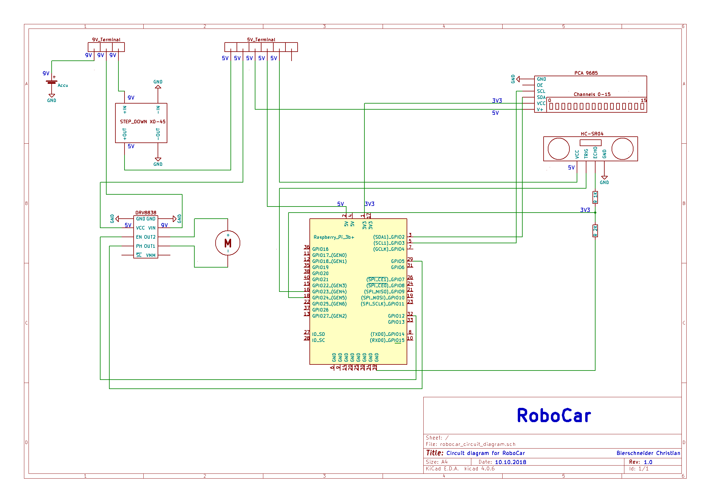

# RoboCar
The main aim of this repo is to set up a low-cost remote-controlled robotic car
and later on a completely autonomous driving car with a Raspberry Pi 3b+

#### Table of Contents:

- [Hardware](https://github.com/bierschi/robo_car#hardware)
    - [Components](https://github.com/bierschi/robo_car#components)
    - [Circuit Diagram](https://github.com/bierschi/robo_car#circuit-diagram)
- [Software](https://github.com/bierschi/robo_car#software)
    - [Remote-controlled](https://github.com/bierschi/robo_car#remote-controlled)
    - [Autonomous driving](https://github.com/bierschi/robo_car#autonomous-driving)
- [Operating System](https://github.com/bierschi/robo_car#operating-system)
    - [Install Ubuntu Mate for Raspberry Pi 3b+](https://github.com/bierschi/robo_car#instructions-to-install-ubuntu-mate-for-raspberry-pi-3b)
    - [Install ROS on Ubuntu Mate](https://github.com/bierschi/robo_car#instructions-to-install-ros-on-ubuntu-mate)
- [Project Layout](https://github.com/bierschi/robo_car#project-layout)

## Hardware
To build this platform, two essential part have to be considered. On
the one hand the used hardware components and on the other hand the wiring of
the individual components

#### Components
Here are listed all hardware components that were used to build this RoboCar

- **Chassis**:
    - 4WD RC Smart Auto Chassis: [Auto Chassis](https://de.aliexpress.com/item/4WD-RC-Smart-Auto-Chassis-F-r-Arduino-Plattform-Mit-MG996R-Metal-Gear-Servo-Lagersatz-Lenkgetriebe/32830665408.html?spm=a2g0x.search0104.3.2.106a2f5f4Hjmhg&ws_ab_test=searchweb0_0%2Csearchweb201602_4_10320_10152_10065_10151_10344_10068_10342_10547_10343_10340_10341_10548_10696_10084_10083_10618_10304_5725020_10307_10820_10821_10302_5724920_5724120_10843_5724020_10059_100031_10319_5724320_10103_10624_10623_10622_10621_10620_5724220%2Csearchweb201603_2%2CppcSwitch_5&algo_expid=0a82566b-deae-43f9-9fa3-5f2403602186-0&algo_pvid=0a82566b-deae-43f9-9fa3-5f2403602186&transAbTest=ae803_2&priceBeautifyAB=0)

- **Motor equipment**:
    - Servomotor MG996R (already included in the auto chassis): [Servomotor](https://www.ebay.de/itm/192047974387)
    - Gearmotor (already included in the auto chassis): [Gearmotor](https://www.ebay.de/itm/132733015168)
    - Motordriver Pololu DRV8838: [Motor Driver](https://www.ebay.de/itm/Pololu-DRV8838-Single-Brushed-DC-Motor-Driver-Carrier-2990/272351389574?ssPageName=STRK%3AMEBIDX%3AIT&_trksid=p2057872.m2749.l2649)

- **Raspberry Pi 3b+**: [Raspberry Pi 3b+](https://www.amazon.de/dp/B07BDR5PDW/ref=sxnav_sxwds-bovbp-i_m_2?pf_rd_m=A3JWKAKR8XB7XF&pf_rd_p=b3231e2b-a779-4655-bc87-f09acb903eca&pd_rd_wg=0coGd&pf_rd_r=GXQJP37HWMA1E86RFGCP&pf_rd_s=desktop-sx-nav&pf_rd_t=301&pd_rd_i=B07BDR5PDW&pd_rd_w=zJXAB&pf_rd_i=raspberry+pi+3+b%2B&pd_rd_r=063492d1-ecbd-4f0a-b68a-2442561c6d08&ie=UTF8&qid=1535019097&sr=2)

- **Power Supply**:
    - Kraftmax RC accumulator : [Accumulator](https://www.amazon.de/gp/product/B00GOWVBU6/ref=oh_aui_detailpage_o02_s00?ie=UTF8&psc=1)
    - Step Down Poti: [Step Down XD-45](https://www.ebay.de/itm/XD-45-MH-mini-360-Wandler-Buck-Step-Down-Poti-DC-DC-LM2596-RC-Modul/253093535843?ssPageName=STRK%3AMEBIDX%3AIT&_trksid=p2057872.m2749.l2649)

- **Sensors**:
    - PiCamera: [PiCamera](https://www.amazon.de/Raspberry-Pi-V2-1-1080P-Kamera-Modul/dp/B01ER2SKFS/ref=sr_1_6?s=computers&ie=UTF8&qid=1539427901&sr=1-6&keywords=pi+kamera)
    - Ultrasonic ranging module HC-SR04 + SG90 Servomotor: [Ultrasonic + Servo](https://www.ebay.de/itm/SG90-Servo-HC-SR04-Ultraschall-Entfernungsmodul-KFZ-Halterung/322711484715?ssPageName=STRK%3AMEBIDX%3AIT&var=511769911508&_trksid=p2060353.m2749.l2649)
    - PCA9685 PWM/Servo Driver: [PCA9685](https://www.ebay.de/itm/PCA9685-16-Kanal-Driver-Servomotor-Treiber-Modul-PWM-I2C-Arduino-Raspberry-Pi/253285067342?ssPageName=STRK%3AMEBIDX%3AIT&_trksid=p2057872.m2749.l2649)
    - MPU6050: [MPU6050](https://www.ebay.de/itm/GY-521-MPU-6050-3-Achsen-Gyroskop-Accelerometer-module-Raspberry-Pi-for-Arduino/272260489619?ssPageName=STRK%3AMEBIDX%3AIT&_trksid=p2057872.m2749.l2649)
    - Laser Scanner Hokuyo URG-04LX-UG01: [Hokuyo URG](https://www.robotshop.com/de/de/hokuyo-urg-04lx-ug01-scan-laser-entfernungsmesser-eu.html?gclid=Cj0KCQjw6MHdBRCtARIsAEigMxFSq916Qq001TadjiVhvlQdLHBiCjHoI453lspePQd77kCsp5AZhw4aApSKEALw_wcB)
    - Laser Scanner RPLidar A1: [RPLidar A1](https://de.aliexpress.com/item/12-mt-Lidar-RPLIDAR-A1-verbessert-360-grad-Lidar-Scannen-Im-Bereich-EINE-neue-verbesserte-version/32862806452.html?spm=a2g0x.search0104.3.2.7b59bf04YGt7RO&transAbTest=ae803_5&ws_ab_test=searchweb0_0%2Csearchweb201602_1_10320_10065_10068_318_10547_319_10548_10696_450_10084_10083_10618_452_535_534_10304_10307_533_10820_532_10821_5727311_10302_204_10843_5727211_10059_10884_10887_100031_10319_320_10103_448_449%2Csearchweb201603_2%2CppcSwitch_0&algo_pvid=622b8212-2b4b-484f-979e-0fab781315a0&priceBeautifyAB=0&algo_expid=622b8212-2b4b-484f-979e-0fab781315a0-0)
    - Laser Scanner RPLidar A2: [RPLIdar A2](https://de.aliexpress.com/item/Slamtec-RPLIDAR-A2-2D-360-grad-12-meter-scannen-radius-lidar-sensor-scanner-f-r-bstacle/32893709845.html?spm=a2g0x.search0104.3.2.57c8748fEgi3nC&transAbTest=ae803_5&ws_ab_test=searchweb0_0%2Csearchweb201602_1_10320_10065_10068_318_10547_319_10548_10696_450_10084_10083_10618_452_535_534_10304_10307_533_10820_532_10821_5727311_10302_204_10843_5727211_10059_10884_10887_100031_10319_320_10103_448_449%2Csearchweb201603_2%2CppcSwitch_0&algo_pvid=98320612-5189-4bf7-9049-efd4f4fba2c8&priceBeautifyAB=0&algo_expid=98320612-5189-4bf7-9049-efd4f4fba2c8-0)

Without a Lidar sensor the cost is about ~140€ . With a Lidar the cost
is about ~230€ - ???.

Datasheets for every component can be found under `/hardware`

#### Circuit Diagram
The Circuit Diagram is shown below to connect the individual components.
A pdf file is under `/circuit_diagram`

   
  

## Software

This Software is written in C++, build with [CMake](https://cmake.org/) and is divided in
`Remote-controlled` and `Autonomous driving` with different submodules:

### Remote-controlled:
##### RoboCar:

##### GUI:

##### Testing:

### Autonomous driving:

## Operating System
As operating system [Ubuntu Mate](https://ubuntu-mate.org/) was selected. Due to the reason
that currently no official raspberry pi 3b+ is provided (25.10.2018), litte hacks are necessary to get
it running.
  
**Problem**: The Rasperry Pi 3b+ shows only a rainbow screen and will not boot

 

#### Instructions to install Ubuntu Mate for Raspberry Pi 3b+
 

1. Download Ubuntu Mate image for Raspberry Pi 2/3 [here](https://ubuntu-mate.org/download/)
2. Flash Ubuntu Mate image on sd card
3. Insert sd card into a **Raspberry Pi 2** or **Raspberry Pi 3**
4. Boot Raspberry Pi 2/3 and insert subsequent command for a kernel update

<pre><code>
sudo CURL_CA_BUNDLE=/etc/ssl/certs/ca-certificates.crt rpi-update
</pre></code>
alternative:
<pre><code>
sudo BRANCH=stable rpi-update
</pre></code>

5. Insert sd card into Raspberry Pi 3b+, now the raspi should start booting
6. No wifi is available!
    - Install a new [raspbian](https://www.raspberrypi.org/downloads/raspbian/) image on sd card
    - boot a raspberry pi with this sd card
    - copy folder `/lib/firmware/bcrm` on a usb
    <pre><code>
    sudo cp -r /lib/firmware/bcrm /path_to_usb
    </pre></code>
    - boot Raspberry Pi 3b+ with Ubuntu Mate
    - replace current `/lib/firmware/bcrm` with the folder on usb stick
    <pre><code>
    sudo cp -r /path_to_usb/lib/firmware/bcrm /lib/firmware/bcrm
    </pre></code>
7. Reboot and wifi should be available
8. Enable ssh on boot. Insert in terminal:
<pre><code>
sudo systemctl enable ssh
</pre></code>

 

#### Instructions to install [ROS](http://www.ros.org/) on Ubuntu Mate
 

1. Setup sources.list
<pre><code>
sudo sh -c 'echo "deb http://packages.ros.org/ros/ubuntu $(lsb_release -sc) main" > /etc/apt/sources.list.d/ros-latest.list'
</pre></code>
2. Setup keys
<pre><code>
wget http://packages.ros.org/ros.key -O - | sudo apt-key add -
</pre></code>
3. Update packages
<pre><code>
sudo apt-get update
</pre></code>
4. Install ros-kinetic-desktop-full
<pre><code>
sudo apt-get install ros-kinetic-desktop-full
</pre></code>
5. Initialize rosdep
<pre><code>
sudo rosdep init
</pre></code>
<pre><code>
rosdep update
</pre></code>
6. Setting up the ROS environment variables
<pre><code>
echo "source /opt/ros/kinetic/setup.bash" >> ~/.bashrc
</pre></code>
<pre><code>
source ~/.bashrc
</pre></code>
7. Create a catkin workspace
<pre><code>
mkdir -p ~/catkin_ws/src
</pre></code>
<pre><code>
cd ~/catkin_ws/
</pre></code>
<pre><code>
catkin_make
</pre></code>
<pre><code>
source ~/catkin_ws/devel/setup.bash
</pre></code>
8. If you want access to source builded ros packages everywhere in your linux system
<pre><code>
echo “source ~/catkin_ws/devel/setup.bash” >> ~/.bashrc
</pre></code>
9. Start roscore master
<pre><code>
roscore
</pre></code>

## Project Layout
<pre><code>
/circuit_diagram
    robocar_circuit_diagram.pdf

/hardware
    /chassis
    /motors
    /power_supply
    /raspberry
    /sensors
    README.md

/images
    circuit_diagram_robocar.png

/scripts
    README.md
    os_settings.sh
    ros_install.sh

/software
    /gui
        /build
        /images
        /include
            ClientSocket.h
            Socket.h
            SocketException.h
            mainwindow.h
        /src
            ClientSocket.cpp
            Socket.cpp
            mainwindow.cpp
            mainwindow.ui
        main_gui.cpp
        CMakeLists.txt
    /robocar
        /build
        /configs
        /include
            /comm
                I2C.h
                ServerSocket.h
                Socket.h
                SocketException.h
            /sensors
                Camera.h
                CameraServo.h
                GearMotor.h
                MPU6050.h
                PCA9685.h
                SteeringServo.h
                Ultrasonic.h
        /lib
        /src
            /comm
                I2C.cpp
                ServerSocket.cpp
                Socket.cpp
            /sensors
                Camera.cpp
                CameraServo.cpp
                GearMotor.cpp
                MPU6050.cpp
                PCA9685.cpp
                SteeringServo.cpp
                Ultrasonic.cpp
        CMakeLists.txt
        robocar_main.cpp
    /testing
        client.cpp
        client.h
        gearmotor.py
        hokuyo_lidar.py
        main_client.cpp
        main_i2c.cpp
        main_server.cpp
        main_serversocket.cpp
        picamera_stream.py
        server.cpp
        server.h
        servomotor.py
        ultrasonic.py
    README.md
LICENSE
README.md

</pre></code>